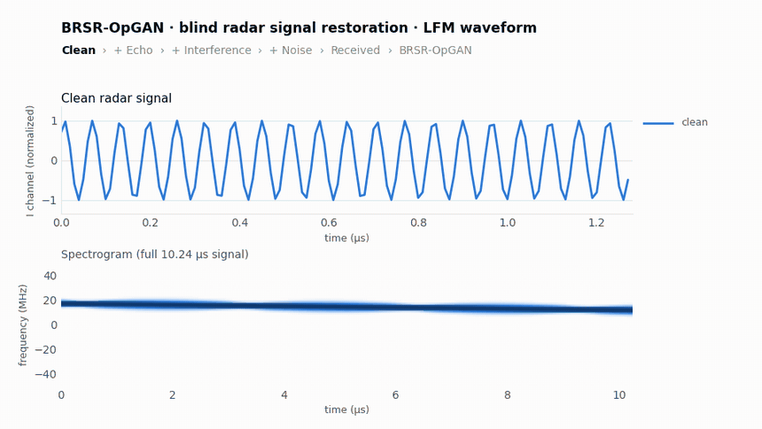
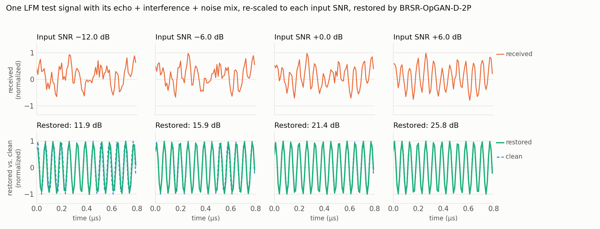
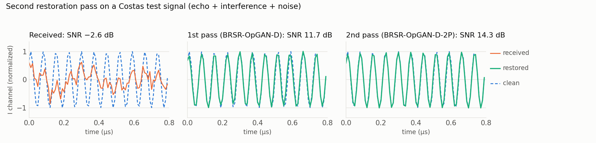

# BRSR-OpGAN: Blind Radar Signal Restoration using Operational Generative Adversarial Network

[](https://doi.org/10.1016/j.neunet.2025.107709)
[](https://arxiv.org/abs/2407.13949)
[](https://doi.org/10.5281/zenodo.23010395)
[](LICENSE)

Official PyTorch implementation of **BRSR-OpGAN** (Neural Networks 190, 2025, 107709) and home of the **BRSR dataset**, the Blind Radar Signal Restoration benchmark. BRSR-OpGAN restores radar signals corrupted by an unknown blend of **additive white Gaussian noise (AWGN)**, **echo** and **co-channel interference (CCI)**. It makes no assumption about the type or severity of the corruption (blind restoration). It is a 1D **Operational GAN** built from **Self-Organized Operational Neural Network (Self-ONN)** layers and trained with a **dual-domain (time + frequency) loss**.

<p align="center">
  
</p>
<p align="center"><em>A real BRSR test signal (LFM): echo, co-channel interference and noise are added to the clean waveform, then BRSR-OpGAN-D-2P restores it from −0.1 dB to 21.1 dB SNR. This is one of the best-restored test signals; average results are in the tables below. Top: I channel; bottom: spectrogram. Signals are min–max normalized, as the network sees them.</em></p>

This repository provides:

- the **BRSR dataset** download (85,800 paired clean/corrupted radar signals, 12 LPI radar waveform classes; hosted on Zenodo);
- **pre-trained models**: BRSR-OpGAN (time, dual-domain, 2-pass) and CNN-GAN baselines, for both the BRSR and the AWGN-Baseline dataset;
- **training and evaluation code** that reproduces the paper's results, plus reference results per SNR bin, artifact type and modulation class;
- the MATLAB **radar signal data generation** code.

The same dataset is used by the follow-up works **CoRe-Net** and **XCoRe-Net** (see [Related work](#related-work)).

---

## BRSR dataset

**Download:** [Zenodo record 23010395](https://zenodo.org/records/23010395) (DOI [10.5281/zenodo.23010395](https://doi.org/10.5281/zenodo.23010395), CC BY 4.0), or run `python download_data.py`.

| | BRSR (blind) | AWGN-Baseline |
|---|---|---|
| Corruption | random blend of AWGN, echo and CCI (7 combinations) | AWGN only |
| Input SNR | continuous, uniform in [−14, 10] dB | 13 levels, −14 : 2 : 10 dB |
| Signals | 2 × 1024 complex I/Q samples at 100 MHz | same |
| Classes | 12 LPI radar waveforms: LFM, Costas, BPSK, Frank, P1–P4, T1–T4 | same |
| Splits | 49,920 train / 12,480 validation / 23,400 test | same |

Each split is an HDF5 file with `clean`, `noisy`, `label`, `snr_db` and, for BRSR, the individual artifact components `distortions` (AWGN, echo, CCI). Per-sample metadata (SNR bin, artifact composition and weights, echo delay, interference ID) is in `*_metadata.csv`. These files are the exact data used in the papers. The original generator was not seeded, so please use the released splits.

```python
from data import load_split
test = load_split("data", "brsr", "test")          # dict of numpy arrays
test["clean"].shape, test["noisy"].shape           # (23400, 2, 1024) each
```

## Quick start

```bash
git clone https://github.com/MUzairZahid/BRSR-OpGAN.git
cd BRSR-OpGAN
pip install -r requirements.txt

python download_data.py --dataset brsr --splits test   # ~0.6 GB, enough for evaluation
python evaluate.py --dataset brsr                      # reproduces Tables 2 and 3 of the paper
```

Train from scratch (full dataset: `python download_data.py`):

```bash
python train.py --dataset brsr --Q 3 --lambda_freq 2      # BRSR-OpGAN, dual-domain loss
python train.py --dataset brsr --Q 3 --lambda_freq 0      # time-domain loss only
python train.py --dataset brsr --Q 1                      # CNN-GAN baseline
python train.py --dataset brsr --Q 3 --first_pass pretrained_weights/brsr/BRSR_OpGAN_Q3_Dual_Domain.pth   # 2nd pass
python evaluate.py --dataset brsr --checkpoint runs/<run>/generator_best.pth --q 3
```

The README animation and figures are made with `python scripts/make_demo_figures.py` (needs `matplotlib` and `ffmpeg`).

Paper settings: Adam, learning rate 5·10⁻⁴, batch size 64, up to 1000 epochs, Q = 3; the model with the best validation SNR is kept.

## Pre-trained models and results

`pretrained_weights/brsr/` and `pretrained_weights/awgn_baseline/` contain the generators used in the paper, with their original training logs. `python evaluate.py` reproduces the numbers below; full results by SNR bin, artifact composition and modulation class are in [`reference_results/`](reference_results).

**BRSR dataset, test split (23,400 signals):**

| Model | SNR (dB) | PSNR (dB) | MSE | SI-SDR (dB)* |
|---|---|---|---|---|
| Corrupted input | −1.94 | 4.19 | 9.65 | −2.02 |
| CNN-GAN-T | 8.87 | 14.99 | 0.39 | 6.93 |
| CNN-GAN-D | 9.04 | 15.16 | 0.42 | 7.04 |
| BRSR-OpGAN-T | 9.53 | 15.66 | 0.34 | 7.96 |
| BRSR-OpGAN-D | 10.33 | 16.46 | 0.32 | 8.78 |
| **BRSR-OpGAN-D-2P** | **12.36** | **18.49** | **0.23** | **10.93** |

**AWGN-Baseline, test split, restored SNR (dB) at selected input SNRs:**

| Model | −14 dB | −8 dB | −2 dB | 4 dB | 10 dB |
|---|---|---|---|---|---|
| CNN-GAN-T | 1.29 | 6.00 | 11.36 | 15.71 | 18.64 |
| CNN-GAN-D | 1.39 | 6.07 | 11.31 | 15.62 | 18.59 |
| BRSR-OpGAN-T | 1.28 | 6.74 | 12.16 | 16.47 | 19.43 |
| BRSR-OpGAN-D | 1.22 | 6.68 | 12.11 | 16.47 | 19.49 |

<p align="center"></p>
<p align="center"><em>One LFM test signal with its own echo + interference + noise mix, re-scaled to different input SNRs and restored by BRSR-OpGAN-D-2P.</em></p>

<p align="center"></p>
<p align="center"><em>The second restoration pass (BRSR-OpGAN-D-2P) on a Costas test signal.</em></p>

T = time-domain loss, D = dual-domain loss, 2P = second restoration pass. SNR, PSNR and MSE follow the paper's evaluation protocol. \*SI-SDR is an additional blind metric (see below). The BRSR numbers match Tables 2 and 3 of the paper to within 0.04 dB. The AWGN-Baseline checkpoints differ from Table 1 of the paper by at most 0.09 dB.

## Evaluation protocol

The paper follows the per-signal protocol that was common at the time. Each signal is min–max scaled to [−1, 1] per channel. The network output is mapped back to physical units with the **clean** signal's min/max before SNR, PSNR and MSE are computed. That rescaling uses reference information that is not available in blind deployment. In our later work (XCoRe-Net) we therefore use global normalization with training-set statistics ([`docs/norm_stats.json`](docs/norm_stats.json)). `evaluate.py` reports the paper metrics together with two blind metrics: SI-SDR, and SNR after rescaling with the noisy signal's range. Details: [docs/EVALUATION_PROTOCOL.md](docs/EVALUATION_PROTOCOL.md).

## Repository structure

```
BRSR-OpGAN/
├── models.py              # ResidualGenerator / ResidualDiscriminator (1D Self-ONN U-Net GAN)
├── selfonn.py             # 1D Self-ONN layer (Q-th order operational neuron)
├── data.py                # HDF5 loading, per-signal normalization, DataLoaders
├── utils.py               # dual-domain training loop, SNR, spectrogram loss
├── train.py               # training (incl. 2nd pass)
├── evaluate.py            # evaluation and grouped results
├── download_data.py       # BRSR dataset download from Zenodo with checksum check
├── scripts/               # make_demo_figures.py: README animation and figures
├── pretrained_weights/    # released generators (+ original training logs)
├── reference_results/     # test results of the released generators
├── docs/                  # evaluation protocol, normalization statistics, figures
└── data_generation/       # MATLAB radar waveform + artifact generator
```

## Related work

- **CoRe-Net**: Co-Operational Regressor Network with Progressive Transfer Learning for Blind Radar Signal Restoration. *Machine Learning with Applications*, 25, 100939 (2026). [doi:10.1016/j.mlwa.2026.100939](https://doi.org/10.1016/j.mlwa.2026.100939)
- **XCoRe-Net**: Expert Co-Operational Regressor Networks for High-Fidelity Restoration of Radar Signals.

Both are evaluated on the same BRSR dataset and splits.

## Citation

If you use this code, the pre-trained models or the BRSR dataset, please cite:

```bibtex
@article{zahid2025brsropgan,
  title   = {{BRSR-OpGAN}: Blind radar signal restoration using operational generative adversarial network},
  author  = {Zahid, Muhammad Uzair and Kiranyaz, Serkan and Yildirim, Alper and Gabbouj, Moncef},
  journal = {Neural Networks},
  volume  = {190},
  pages   = {107709},
  year    = {2025},
  doi     = {10.1016/j.neunet.2025.107709}
}

@dataset{zahid2026brsr_dataset,
  title     = {{BRSR} Dataset: Blind Radar Signal Restoration Benchmark (v1.0)},
  author    = {Zahid, Muhammad Uzair and Kiranyaz, Serkan and Yildirim, Alper and Gabbouj, Moncef},
  publisher = {Zenodo},
  version   = {1.0},
  year      = {2026},
  doi       = {10.5281/zenodo.23010395}
}
```

## License

Code: MIT (see [LICENSE](LICENSE)). BRSR dataset: CC BY 4.0 (Zenodo).

## Contact

Please open a GitHub issue, or contact Muhammad Uzair Zahid (muhammaduzair.zahid@tuni.fi).

---

**Keywords:** BRSR-OpGAN, BRSR dataset, Blind Radar Signal Restoration, radar signal restoration, radar signal denoising, radar denoising deep learning, echo removal, co-channel interference suppression, operational GAN, OpGAN, Self-ONN, operational neural networks, generative adversarial network, LPI radar waveforms, radar waveform dataset, I/Q signals, CoRe-Net, XCoRe-Net, PyTorch.
